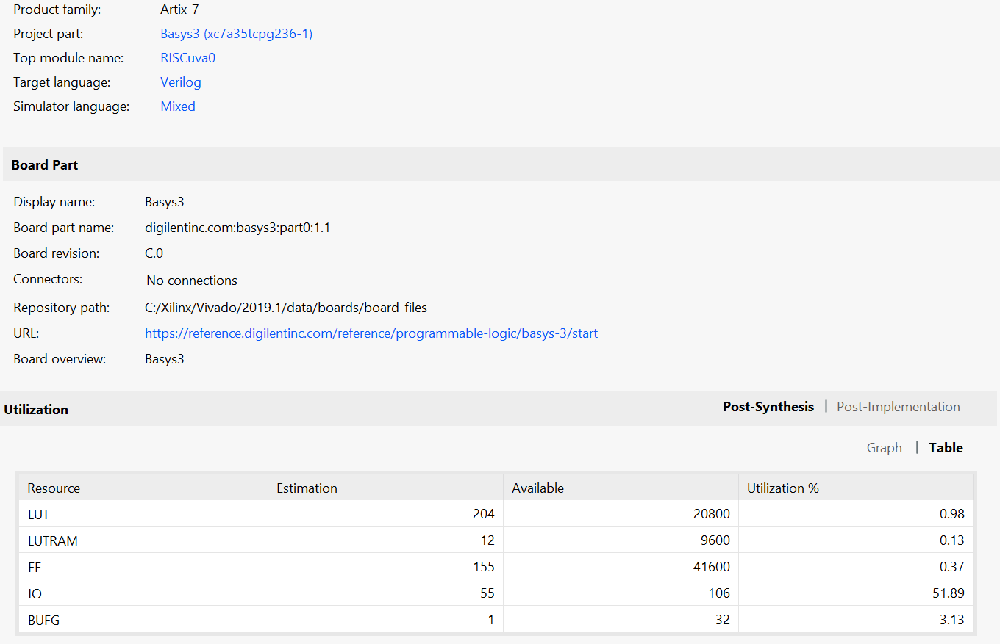

# simple8bitCPU

http://www.epyme.uva.es/Docs/Public/Conferences/FPGAworld2006a.pdf

RISCuva0.sv is the System Verilog version of the CPU

RISCuva1.v is the Verilog version (See the published paper)

programMemory.sv is the program ROM, and mySystem.sv is the testbench.

Resource utilization resport is given below. 

On a BASYS3 board FPGA, less than 1% of the critical resources (LUT,LUTRAM,FF) are used. Note that BUFG's are buffers and IO's are IO pins. 

